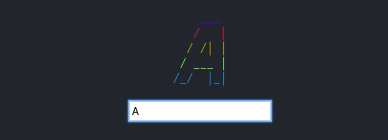
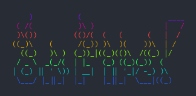
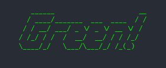

# Usage Examples

## Dynamic Text

You can generate rainbow ASCII on the fly like this:

```jsx
import React, {useState} from 'react'
import ASCII from 'react-rainbow-ascii'

function YourComponent() {
  const [text, setText] = useState('Magic!')
  return (
    <div>
      <ASCII text={text} />
      <input type="text" value={text} onChange={e=>setText(e.target.value)}>
    </div>
  )
}
```



## Custom Figlet Font

You can use any of the [importable fonts from Figlet](https://github.com/patorjk/figlet.js/tree/master/importable-fonts) like this:

```jsx
import React from 'react'
import ASCII from 'react-rainbow-ascii'
// @ts-ignore
import FireFont from 'figlet/importable-fonts/Fire Font-k'

function YourComponent() {
  return (
    <div>
      <ASCII text='On Fire!' font={FireFont} />
    </div>
  )
}
```



Note: If you use TypeScript, the `// @ts-ignore` comment will allow you to import the font files from Figlet.

## Solid Color

If you want your ASCII to be a solid color, you can disable the rainbow and set the color of the parent element using CSS:

```jsx
<div style={{ color: 'rgb(0,255,0)' }}>
  <ASCII text='Green!' rainbow={false} />
</div>
```



## Multiple Instances

When you have multiple instances on a page at the same time, you may experience problems with the responsiveness of the ASCII or other layout problems. To fix this, pass a unique `id` prop to the component:

```jsx
<ASCII text="One!" id="one" />
<ASCII text="Two!" id="two" />
```

## SEO/Accessibility Fallback

If you're using a static site generator (like [Gatsby](https://www.gatsbyjs.org/)), this component renders a fallback element when JavaScript is disabled. By default, the fallback markup looks like this;

```html
<div class="responsive-ascii" title="Hello!" aria-label="Hello!">
  <pre>Hello!</pre>
</div>
```

If you want control over this for SEO or accessibility, you can set a custom fallback element to wrap your input text like this:

```jsx
<ASCII text='Hello!' fallback='h1' />
```

Which will render the following fallback markup:

```html
<div class="responsive-ascii" title="Hello!" aria-label="Hello!">
  <h1>Hello!</h1>
</div>
```
